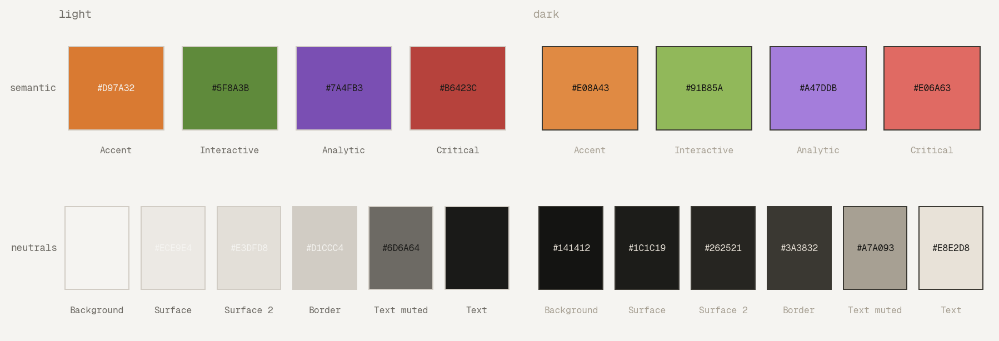
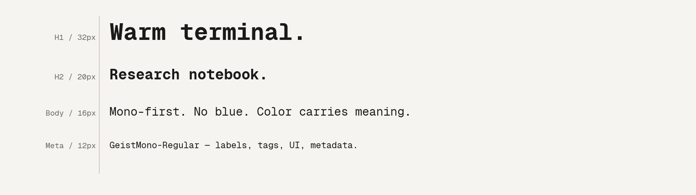
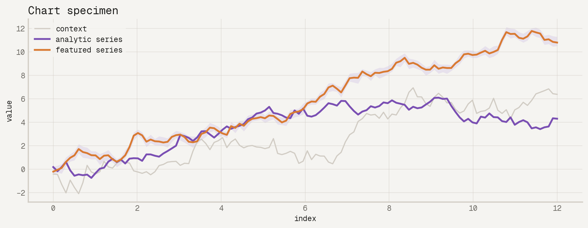

# bb-brand

**For agents:** stop reading this — go to `https://raw.githubusercontent.com/BBischof/bb-brand/main/quick.md`

**For humans:** paste this into any AI with web access to load Bryan's brand context:

```
Fetch my brand context from https://raw.githubusercontent.com/BBischof/bb-brand/main/quick.md
— for the full spec use https://raw.githubusercontent.com/BBischof/bb-brand/main/AGENTS.md
```

---

Bryan Bischof personal brand kit — tokens, themes, and agent setup scripts.





## Contents

| Path | What it is |
|---|---|
| `quick.md` | ~100-token agent quick reference |
| `AGENTS.md` | Full semantic spec for agents |
| `tokens/tokens.json` | Source of truth for all design tokens |
| `tokens/tokens.css` | Generated CSS custom properties |
| `tokens/tokens.py` | Generated Python dict |
| `tokens/generate.py` | Regenerates css/py from json |
| `fonts/` | GeistMono Regular and Bold |
| `themes/bbplot.py` | Standalone matplotlib theme |
| `css/base.css` | Reset + typography, ready to import |
| `css/components.css` | Card, badge, tag, button, table, alert |
| `starters/web/` | Minimal on-brand HTML/CSS scaffold |
| `starters/dataviz/` | Minimal Python chart starter |
| `scripts/init.sh` | Inject brand opt-in into a project |
| `scripts/install.sh` | Install the `brand-init` alias |

## Opting a project in

From the project root:

```sh
curl -fsSL https://raw.githubusercontent.com/BBischof/bb-brand/main/scripts/init.sh | bash
```

Or with the alias (after running `scripts/install.sh` once):

```sh
brand-init
```

This appends a one-line brand reference to `CLAUDE.md`, `.cursorrules`,
`.windsurfrules`, and `.github/copilot-instructions.md` — whichever exist
or should exist in that project. It's idempotent and safe to re-run.

## New machine setup

```sh
curl -fsSL https://raw.githubusercontent.com/BBischof/bb-brand/main/scripts/install.sh | bash
```

Adds the `brand-init` alias to your shell config. Can also be called from
your dotfiles `bootstrap.sh`.

## Updating tokens

Edit `tokens/tokens.json`, then:

```sh
uv run --with '' python tokens/generate.py
```

Commits both the json change and the regenerated css/py files.
